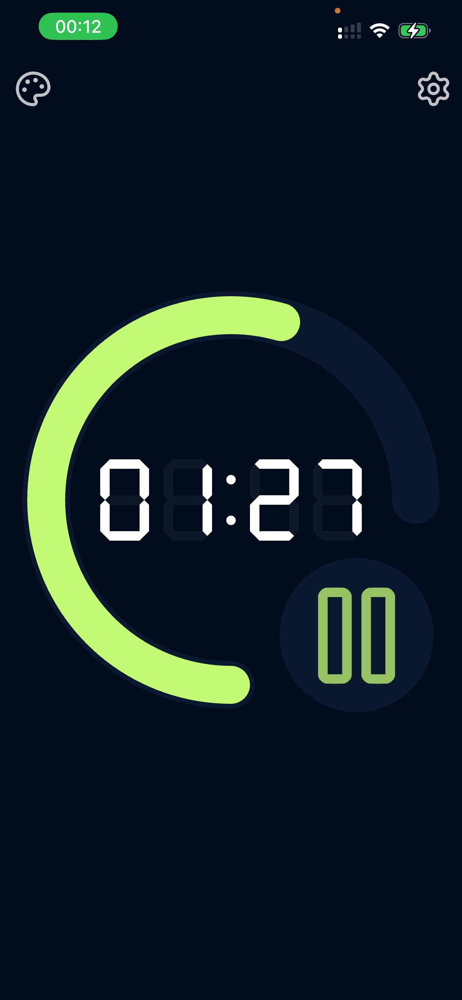

[](https://apps.apple.com/se/app/kvart/id6754662969?l=en-GB)

# Kvart

Kvart (from Swedish "kvart", meaning "quarter") is a visual timer app written in Flutter. 
It does one thing and does it well: it helps you keep track of time in set intervals.



[More screenshots](./screenshots/)

## Distribution
Kvart is available on the [Apple App Store](https://apps.apple.com/se/app/kvart/id6754662969?l=en-GB) for iOS devices and can be downloaded for free.

Android version is planned for the near future.

App contains in-app purchases to unlock additional themes for a minimal one-time fee to support development.

## Development

Kvart is built with Flutter, follow the instructions on [flutter.dev](https://flutter.dev/docs/get-started/install) to set up Flutter on your machine.

Follow https://docs.flutter.dev/platform-integration/ios/setup to set up your iOS development environment.

After that you can use the following commands to run Kvart on your iOS device or simulator:

```bash
flutter pub get
flutter run ios
```

## Support

Kvart is free and open source software, if you find it useful you could consider supporting its development: 

[](https://www.buymeacoffee.com/valeriavg).

